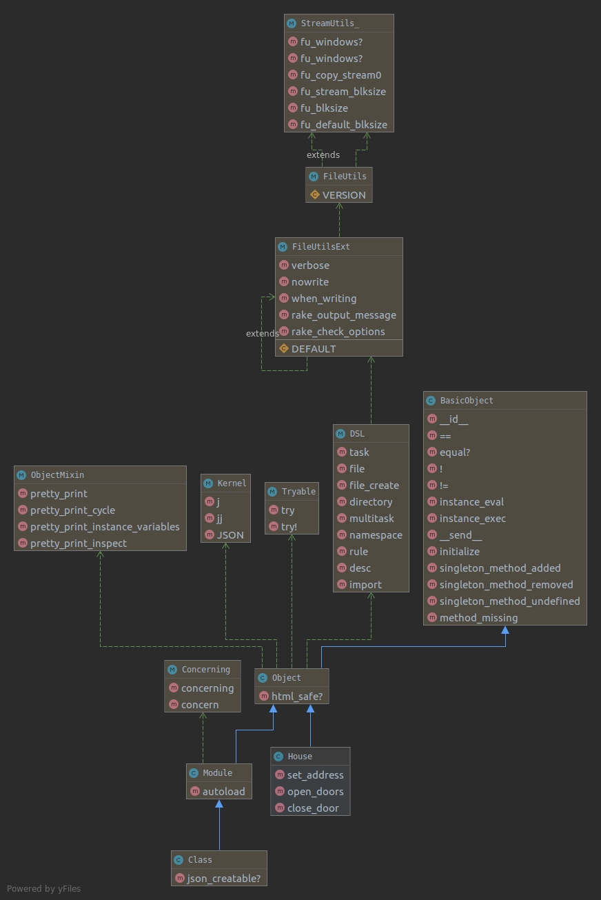

[](https://generalassemb.ly)

# Ruby - Classes Part1

## Objectives

- Work with Ruby classes
- Use getter and setter methods in Ruby

## OOP

One of the defining attributes of the Ruby programming language, in addition to readability, is how it implements object-oriented programming (OOP) techniques.

OOP facilitates writing code in a way that allows you to think about, and model, the concepts that you are working with in your program.

## What is Object Oriented Programming

Object oriented programming is a paradigm of Software Engineering that attempts
to solve the problems of building applications imperatively by organizing
applications into discrete units, called objects.

Rather than imperatively
describe everything we want our application to do, in OOP we define objects that
represent our understanding of the different parts of our application, what
information describes those parts and what behavior those parts have.


> Source:
> [Simple Snippets](https://simplesnippets.tech/java-introduction-to-object-oriented-programming-oop/)

Every object stores and manages any state or data relevant to itself internally.
We almost always have many instances of a type of object.

We use methods to initialize, modify, or act on an objects' internal state.

Because these methods will be the same across all instances of a type of object,
we define a **single class** with all of this behavior described in one place.

We then use that class to instantiate as many instances (objects) of the class
as we need.

Object oriented programming gives use three major benefits:

- **Encapsulation**: The complexity of our objects is hidden and a user can
  interact with a well defined set of methods. We can redefine internal behavior
  without changing anything externally - a huge benefit for refactoring.
- **Modularity**: Because the interface (set of methods) for an object is well
  defined, it is easy to exchange one object for another and reorganize objects
  without breaking them.
- **Inheritance**: Object Oriented design lets certain classes inherit from, or
  borrow the behavior of another, more general class. The inheriting class can
  add and overwrite inherited methods.

You can think of an object as a little machine: it has displays you can read and
buttons you can push. When you write an object-oriented application, you are
modeling the entire program as the interactions of these machines.

## Object

In object-oriented programming, the fundamental unit is the object. An object is an entity that serves as a container for data and also controls access to the data. Associated with an object are:

- a set of attributes, which are essentially no more than variables belonging to the object
- a set of functions that provide an interface to the functionality of the object, called methods.

## Classes

Classes are the foundation of object-oriented programming (OOP) and are abstract templates for objects. You can also say that objects are instances of classes.

Classes contain the template for a set of behaviors (such as methods) and data (such as variables).  Here are 4 examples of how classes are constructed in JavaScript, Ruby, Python and PHP.


<p align="center">
    
    <br>
</p>


The use case for working Classes to to create a `blue print` of some data model.  Architects use this approach all the time when they design a structure such as a house. 

<p align="center">
    
    <br>
</p>

This blueprint would contain essentially, every attribute/feature of the house, such as:

- The dimensions for each room
- How the plumbing will flow
- Where the light switches are located 

## Instance

So after the blueprint is completed, homes of identical dimensions and specifications can be built.

<p align="center">
    
    <br>
</p>

## Creating a class

Here is an example of how we can create a House class to do this:

```ruby
class House

end
```

## Instance methods

Since each `instance` of the house needs to perform the same base functionality, `instance methods` are methods are created on the base class and then available on any instantiated instances. 

Instances have states that are held in instance variables. As you would expect, instance methods have access to these instance variables.


## Creating methods

Based on what we know about houses we can assume that the `House` class will have the following methods: 

- `set_address`
- `open_door`
- `close_door`

Let's add those methods. 

```ruby
class House
  def set_address
    p "setting address"
  end

  def open_doors
      p "open door"
  end

  def close_door
    p "close door"
  end
end
```

## Instantiation of an object

With the `House` class created we can now `instantiate` a new instances of the `House`.

```ruby
my_house = House.new
```

Add call the `open_door` method.

```ruby 
my_house.open_door
```

<hr>

:question: Where else have we used `.new` before in Ruby?


<hr>

#### <g-emoji class="g-emoji" alias="alarm_clock" fallback-src="https://github.githubassets.com/images/icons/emoji/unicode/23f0.png">⏰</g-emoji> Activity - 2min

- Instantiate a new instance of the House class called `your_house`
- Try calling `close_door` on the `your_house` instance

<hr>

<!-- <p align="center">
    
    <br>
    <b>Under the hood of our House class</b>
</p> -->

## Instance variables

`instance variables` are available to a particular instance and are created using the `@` sign when we first define the variable.

An `instance variable` is a variable that is accessible in any instance method in a particular instance of a class.

```ruby
class House
  # instance variables; unique data for each object: casey and suresh
  @this_address = ''

  def set_address(address)
    @this_address = address
  end

  def get_address
    @this_address
  end

  #...previous methods
end

casey_house = House.new
casey_house.set_address("111, New York, NY")
p casey_house.get_address

```

<hr>

#### <g-emoji class="g-emoji" alias="alarm_clock" fallback-src="https://github.githubassets.com/images/icons/emoji/unicode/23f0.png">⏰</g-emoji> Activity - 2min

Update the `House` class to include the following instance variable and set it to an empty string:
-  this_owner_name

Then create the following getter and setter methods

- set_owner
- get_owner

Instantiate a new instance of the house with your name and use the `set_owner` method to set the owner to your name.  Then use the `get_owner` method to get that value. 

<hr>

## Initializers

There are times when you want to instantiate a new instance and set values at that time. Ruby does this using an **initializer** method. 

```ruby
class ClassName
  def initialize(arg1, arg2)
    # do something
  end
end
```

This `initialize` method will automatically be invoked when an object of that class type is created using `ClassName.new`.  

Let's update the initialize 

```ruby
class House
  def initialize(address)
    @this_address = address
  end

  def set_address(address)
    @this_address = address
  end

  def get_address
    @this_address
  end

  #...previous methods
end
```

Now we can set the address when it is instantiated.

```ruby
casey_house = House.new("111, Queens, NY")
p casey_house.get_address
```

We still have access to change the address.

```ruby
casey_house.set_address("222, Bronx, NY")
p casey_house.get_address
```

<hr>

#### <g-emoji class="g-emoji" alias="alarm_clock" fallback-src="https://github.githubassets.com/images/icons/emoji/unicode/23f0.png">⏰</g-emoji> Activity - 3min

- Add a new new variable called num_of_rooms to the `initialize` method
- Add the supporting getter/setter methods set_num_of_rooms and get_num_of_rooms
- instantiate your_house again and pass in both address and the number of rooms you want in your house

<hr>

## Questions?
