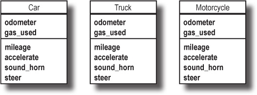
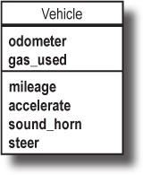
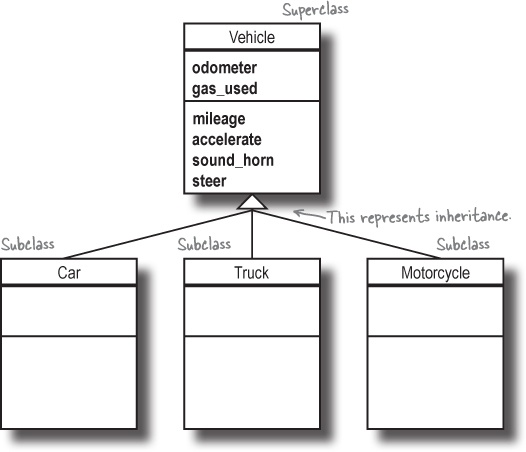

[](https://generalassemb.ly)

# Ruby - Classes Part 2

## Objectives

- Instance variables Vs Class variables
- Describe what is inheritance is
- Demonstrate and implement inheritance using Ruby
- How to use super
- Demonstrate how to implement OOP techniques such as inheritance and polymorphism

## Inheritance

Instead of repeating method definitions across many similar classes, inheritance lets you move the common methods to a single class. You can then specify that other classes inherit from this class. The class with the common methods is referred to as the superclass, and the classes that inherit those methods are known as subclasses.

If a superclass has instance methods, then its subclasses automatically inherit those methods. You can get access to all the methods you need from the superclass, without having to duplicate the methods’ code in each subclass.

> Inheritance allows multiple subclasses to inherit methods from a single superclass

## Example

Here’s how we might use inheritance to get rid of the repetition in the virtual test-drive app.

<p align="center">
 <br>
<b>We see that the Car, Truck, and Motorcycle classes have several instance methods and attributes in common</b>
</p>
Each one of these classes is a type of vehicle. So we can create a new class, which we’ll choose to call Vehicle, and move the common methods and attributes there
<p align="center">
 <br>
<b>Then, we can specify that each of the other classes inherits from the Vehicle class</b>
</p>
<p align="center">
 <br>
<b>The Vehicle class is called the superclass of the other three classes. Car, Truck, and Motorcycle are called subclasses of Vehicle</b>
</p>

The syntax for using inheritance is to define the class name followed by the `<` symbol, followed by the parent class name. For example, our Car class inherits from the Vehicle class with the following syntax:

```ruby
# This is our super class
class Vehicle

end

# Car class inherit from Vehicle class
class Car < Vehicle

end
```

Let's add some code to `Vehicle` so the subclasses have something to inherit.

```ruby
class Vehicle

  # This is our constructor with instance variables
  def initialize(odometer, gas_used)
    @this_odometer = odometer
    @this_gas_used = gas_used
  end

  def sound_horn
    puts "Beep! Beep!"
  end

  def accelerate
    puts "Vroom ... Vroom!!"
  end

  def check_mileage
    puts @this_odometer / @this_gas_used
  end

end

# Car class inherit from Vehicle class
class Car < Vehicle

end

# Truck class inherit from Vehicle class
class Truck < Vehicle

end

# Our first instance
my_car = Car.new(10000, 100)
my_car.accelerate
my_car.sound_horn
my_car.check_mileage
```

<hr>

#### <g-emoji class="g-emoji" alias="alarm_clock" fallback-src="https://github.githubassets.com/images/icons/emoji/unicode/23f0.png">⏰</g-emoji> Activity - 2min

Create an new instance of the Truck class called `your_truck` and assign it the following:

- odometer = 20000
- gas_used = 200

Then call the following methods:

- accelerate
- sound_horn
- check_mileage

<hr>

## Class variables

A class variable is shared among all instances of a class, so only one copy of a class variable exists for a given class.
In Ruby, a class variable is prefixed by two at signs (`@@`).

You must initialize a class variable before you use it.

```ruby
class Student
  @@ga_class = "SEI"

  def initialize(name)
    @this_name = name
  end

  def print_info
    puts "Hi #{@this_name}, you are taking #{@@ga_class}"
  end
end

casey = Student_.new("Casey")
suresh.print_info

```

<hr>

#### <g-emoji class="g-emoji" alias="alarm_clock" fallback-src="https://github.githubassets.com/images/icons/emoji/unicode/23f0.png">⏰</g-emoji> Activity - 2min

- Add a Class variable to the `Vehicle` class called `factory`
- Add a method called `print_factory` to the `Vehicle` class that prints `This vehicle was made in #{@@factory}`
- Invoke `print_factory` on `your_truck`

<hr>

## Class Methods

A class method is a method that is associated with a class not with an instance of a class. You can invoke class methods by prefixing the name of the method with the name of the class to which it belongs, such as to Math.sqrt(36). 

Class methods are also called static methods.

```ruby
  def Employee.print
    puts @@base_salary
  end
```

**or**

```ruby
  def self.print
    puts @@base_salary
  end
```

```ruby
class Employee
  # class scope, uncomment following line to see the value of self
  @@base_salary= 1000

  def initialize(name, salary)
    # object scope
    @this_name = name
    @this_salary = salary
  end

  # class method, also known as static method. Every object shares this method
  def Employee.print
    puts @@base_salary
  end

  def update_salary(salary)
    @this_salary = salary
  end

  def print_my_info
    puts "#{@this_name}"
    puts "#{@this_salary}"
  end

  def set_base_salary(salary)
    @@base_salary = salary
  end
end

s = Employee.new("John", 100)
s.print_my_info
Employee.print

s.set_base_salary(1250.87)
s.print_my_info
Employee.print
```

## Super method

Use the super keyword to call the superclass implementation of the current method. When overriding a class’s method in a subclass, you want to extend or decorate the behavior of the superclass, rather than totally replacing it.

```ruby
class Recipe
  def cook
    puts "Cooking ... it will take about 20 mins"
  end
end

class FishRecipe < Recipe
  def cook
    super
  end
end

my_recipe = FishRecipe.new
my_recipe.cook
```

Here the Child class (`FishRecipe`) inherits from the Parent class (`Recipe`). The child class overrides the Parent class cook method.

Within the Child class cook method, we call super which will call the cook method from the Parent class Recipe.

<hr>

#### <g-emoji class="g-emoji" alias="alarm_clock" fallback-src="https://github.githubassets.com/images/icons/emoji/unicode/23f0.png">⏰</g-emoji> Activity - 2min

- Add a method to your `Car` class called `sound_horn` that extends the `Vehicle` `sound_horn` method and adds another like of text
- Invoke `sound_horn` on your instance of the `Car` class and make sure both lines of text work works!

<hr>

## attr_accessor

`attr_accessor` is a keyword that tells Ruby to define `accessor` methods on the instance. Accessor methods are both the "get" and "set" method for the symbol passed in. In other words, they can be depicted as follows:

Let's say you have a class Person.

```ruby
class Person
  def initialize(name)
    @name = name
  end

  def name
    @name # simply returning an instance variable @name
  end
end

person = Person.new('kenny')
person.name # => 'kenny'
```

But what if we wanted to reset the name after the instance was instantiated?

```ruby
person.name = "stack" # => no method error
```

That would error out.

Aha, we can read the name, but that doesn't mean we can assign the name. Those are two different methods. The former is called reader and latter is called writer. We didn't create the writer yet so let's do that.

```ruby
class Person
  def initialize(name)
    @name = name
  end

  def name
    @name
  end

   def name=value
    @name = value
  end
end

person = Person.new('kenny')
person.name = 'stack'
p person.name # => "stack"
```

Awesome. Now we can write and read instance variable @name using reader and writer methods. Except, this is done so frequently, why waste time writing these methods every time? We can do it easier.

```ruby
class Person
  attr_reader :name
  attr_writer :name

  def initialize(name)
    @name = name
  end

  # def name
  #   @name
  # end

  #  def name=value
  #   @name = value
  # end
end

person = Person.new('kenny')
person.name = 'stack'
p person.name # => "stack"
```

Even this can get repetitive. When you want both reader and writer just use accessor!

```ruby
class Person
  attr_accessor :name
end

person = Person.new('kenny')
person.name = 'stack'
person.name # => "Dennis"
```

Works the same way! And guess what: the instance variable @name in our person object will be set just like when we did it manually, so you can use it in other methods.

```ruby
class Person
  attr_accessor :name

  def greeting
    puts "Hello #{@name}"
  end
end

person = Person.new('kenny')
person.name = 'stack'
person.greeting
```

That's it. As you can see, attr_accessor defines both the getter and the setter.


<hr>

#### <g-emoji class="g-emoji" alias="alarm_clock" fallback-src="https://github.githubassets.com/images/icons/emoji/unicode/23f0.png">⏰</g-emoji> Activity - 2min

- Update the `Vehicle` class to have an `attr_accessor` method for `this_odometer`
- Try setting and getting the `this_odometer` variable using the new methods you have created with `attr_accessor`

<hr>

## Questions?
